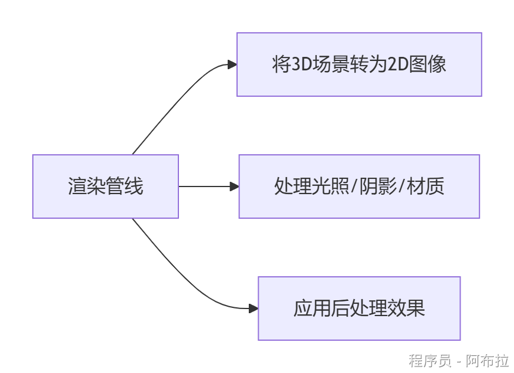

# 概念

### 面试题

1. 什么是渲染管线？
2. Unity 有哪些常用的渲染管线，如何挑选适合当前项目的渲染管线？

### 概念

渲染管线是Unity将游戏场景中的模型、贴图、光照等数据转换为最终屏幕像素的完整流程，包含几何处理、光栅化、像素着色等关键阶段。

### 🎨**渲染管线类型**

| **类型**  | **平台兼容性**            | **画质上限**       | **性能优化**    | **开发难度** |
| --------- | ------------------------- | ------------------ | --------------- | ------------ |
| 内置管线  | 全平台（含OpenGL ES 2.0） | 基础3D效果         | 手动批处理/优化 | 简单         |
| URP       | 移动端/PC/主机/VR         | 中等（PBR+轻量GI） | 自动SRP Batcher | 中等         |
| HDRP      | 仅高端PC/主机             | 电影级（光追/GI）  | 依赖硬件性能    | 复杂         |
| 自定义SRP | 需手动适配                | 完全自定义         | 深度控制GPU资源 | 极难         |

#### 1. **内置渲染管线（Built-in Render Pipeline）**

- **特点**：Unity默认管线，兼容全平台（包括低端设备），但定制性差，仅支持基础渲染效果。
- **适用场景**：2D游戏、快速原型开发或旧平台项目。

#### 2. **通用渲染管线（URP）**

- **优势**：

- 跨平台优化（移动端/PC/VR）
- 支持Shader Graph可视化编辑
- 自动启用GPU实例化与SRP Batcher。

- **适用场景**：中小型3D游戏或需要平衡画质与性能的项目。

#### 3. **高清渲染管线（HDRP）**

- **核心能力**： 

- 实时光追、体积光照、PBR材质
- 仅支持高端硬件（如DX12/Vulkan）。

- **适用场景**：3A级游戏、建筑可视化等高清画质需求。

#### 4. **自定义渲染管线（SRP）**

- **开发自由**：通过C#脚本完全控制渲染流程，适合特殊风格（如卡通渲染）或专业领域（如医学仿真）。

### 选择合适的渲染管线

**移动端/跨平台** → 选择URP

**高端画质/PC主机** → 选择HDRP

**特殊需求/科研项目** → 自定义SRP

**快速开发/兼容旧设备** → 内置管线。
