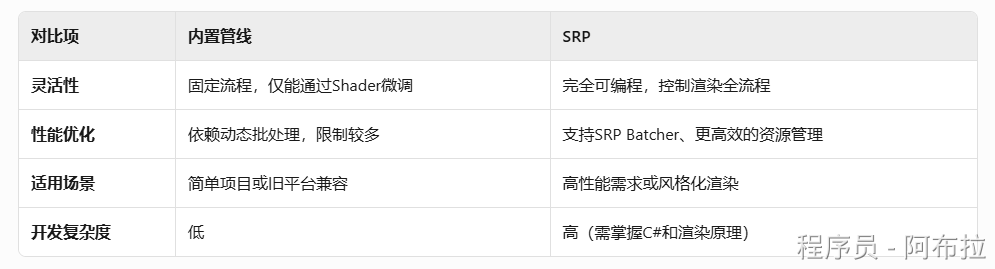
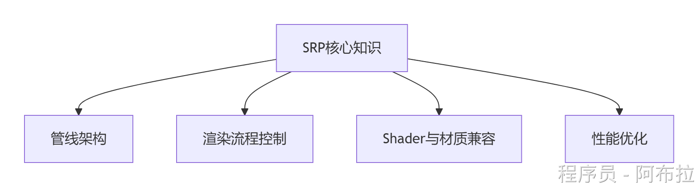

# SRP

## 概念

Unity SRP（**Scriptable Render Pipeline**，可编程渲染管线）是Unity引擎提供的一种高级渲染技术，允许开发者通过C#脚本完全自定义渲染流程，取代传统的固定功能渲染管线。一般情况下，基本上都是中大厂进行定制化渲染，小厂一般没有技术存储。

**官方预置管线**

**URP（Universal Render Pipeline）**：轻量级，跨平台优化，适合移动端和中小型项目。

**HDRP（High Definition Render Pipeline）**：面向高端硬件，支持实时光追、PBR材质，适用于3A级画质需求。

**自定义SRP**

开发者可完全从头编写渲染管线，实现特定风格（如像素风、非真实感渲染）或特殊需求（如科研可视化）



## 特点

**灵活控制**

SRP通过C#脚本控制渲染的每一步，包括剔除、光照计算、材质渲染、后处理等，开发者可以按需优化或实现特殊效果（如卡通渲染、特殊光照模型）。

**模块化设计**

基于`RenderPipelineAsset`（配置入口）和`RenderPipeline`（执行渲染逻辑）两个核心类，支持分层设计渲染流程（如分Pass处理阴影、透明物体等）。

**性能优化**

支持SRP Batcher（减少CPU开销）、动态合批、GPU Instancing等优化技术，尤其适合多平台适配（移动端/PC/主机）

## 自定义 SRP 流程



#### **管线架构基础**

**RenderPipelineAsset**：创建管线资产的入口，继承自`RenderPipelineAsset`并重写`CreatePipeline()`方法。

**RenderPipeline类**：实现`IRenderPipeline`接口或继承`RenderPipeline`，核心逻辑在`Render()`方法中处理逐帧渲染。

#### **渲染流程控制**

**ScriptableRenderContext**：Unity提供的底层渲染上下文，通过`Submit()`提交指令（如绘制天空盒、几何体）。

**CommandBuffer**：封装渲染命令（如清除目标、设置材质属性），需配合`ExecuteCommandBuffer()`执行。

#### **Shader与材质兼容**

**Shader编写**：需适配SRP的着色器标签（如`LightMode="ForwardBase"`），或使用`Unlit`Shader作为起点。

**材质兼容性**：处理内置管线材质到SRP的迁移，或自定义`ShaderGraph`。

#### **性能优化**

**剔除（Culling）**：通过`Camera.TryGetCullingParameters`获取视锥剔除参数，减少不可见物体的渲染。

**批次合并**：利用`SRP Batcher`优化相同材质的物体绘制

### 示例

1. 创建`CustomRenderPipelineAsset`资产
2. 在`Project Settings > Graphics`中指定该资产
3. 运行场景，可见天空盒和基础清除效果

#### **创建管线资产与实例**

```JS
// CustomRenderPipelineAsset.cs
using UnityEngine;
using UnityEngine.Rendering;

[CreateAssetMenu(menuName = "Rendering/Custom SRP")]
public class CustomRenderPipelineAsset : RenderPipelineAsset {
    protected override RenderPipeline CreatePipeline() {
        return new CustomRenderPipeline();
    }
}
```

#### **实现渲染管线类**

```JS
// CustomRenderPipeline.cs
using UnityEngine;
using UnityEngine.Rendering;

public class CustomRenderPipeline : RenderPipeline {
    private CommandBuffer _cmd = new CommandBuffer { name = "Custom SRP" };

    protected override void Render(ScriptableRenderContext context, Camera[] cameras) {
        foreach (var camera in cameras) {
            // 1. 设置相机属性
            context.SetupCameraProperties(camera);
            
            // 2. 清除渲染目标（颜色+深度）
            _cmd.ClearRenderTarget(true, true, Color.clear);
            context.ExecuteCommandBuffer(_cmd);
            _cmd.Clear();

            // 3. 剔除不可见物体
            if (!camera.TryGetCullingParameters(out var cullingParams)) return;
            var cullResults = context.Cull(ref cullingParams);

            // 4. 绘制天空盒
            context.DrawSkybox(camera);

            // 5. 提交渲染指令
            context.Submit();
        }
    }
}
```
