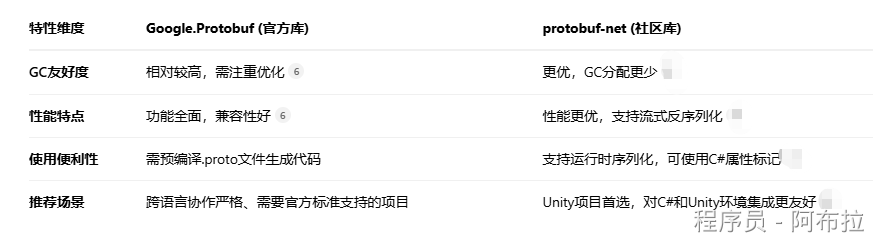
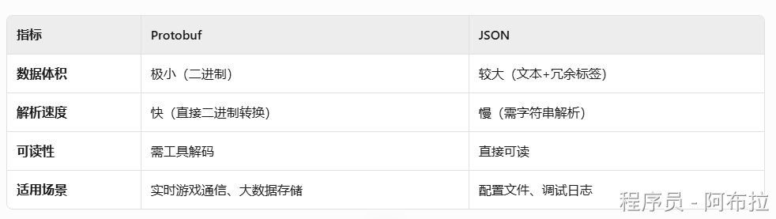

# Protobuf

Protobuf（Protocol Buffers）是Google开发的一种**二进制数据序列化协议**，专为高效传输和存储设计。相比JSON/XML，它具有更小的数据体积（减少50%-90%）和更快的解析速度（快20-100倍）。



#### **核心**

- **.proto文件**：定义数据结构（如消息类型、字段）。
- **protoc编译器**：将.proto文件生成多语言代码（如C#、Java）。
- **运行时库**：实现序列化/反序列化功能。

#### **适用场景**

- 网络通信（如游戏同步、RPC）
- 数据存储（存档、配置表）
- 跨平台数据交换（如Unity与服务器通信）。



### **Unity中如何使用Protobuf？**

#### **1. 安装与配置**

**步骤1**：下载Protobuf库

- 从[GitHub](https://github.com/protocolbuffers/protobuf)获取`protoc`编译器和C#运行时库（如`Google.Protobuf.dll`）。

**步骤2**：导入Unity

- 将`Google.Protobuf.dll`放入`Assets/Plugins`文件夹。

#### **2. 定义数据结构**

**示例.proto文件**（`Player.proto`）：

```js
syntax = "proto3";
message Player {
    string name = 1;
    int32 hp = 2;
    repeated string skills = 3; // 重复字段
}
```

#### **3. 生成C#代码**

**命令行编译**：

```plain
protoc --csharp_out=. Player.proto
```

生成`Player.cs`文件，导入Unity项目。

#### **4. 序列化与反序列化**

```js
using Google.Protobuf;

// 序列化
Player player = new Player { Name = "Hero", Hp = 100, Skills = { "Fireball", "Shield" } };
byte[] data = player.ToByteArray();

// 反序列化
Player parsedPlayer = Player.Parser.ParseFrom(data);
Debug.Log(parsedPlayer.Name); // 输出: Hero
```

### **面试题**

#### 1.  和 JSON、XML 相比，Protobuf 有什么优势？为什么游戏开发中常用它进行网络传输？

Protobuf（Protocol Buffers）是一种语言无关、平台无关的可扩展机制，用于序列化结构化数据。

它与 JSON、XML 相比，主要优势在于

- **更高的序列化/反序列化速度**：采用二进制编码，解析效率远高于文本格式的 JSON 和 XML。
- **更小的数据体积**：二进制格式和高效的编码方式（如 Varint 编码）能显著减少传输数据量，节省带宽，这对网络游戏至关重要。
- **更强的跨语言支持**：通过 `.proto` 文件定义数据结构，可轻松生成多种编程语言的代码，保证了不同语言间数据交换的一致性。
- **更好的向前/向后兼容性**：采用 `[ProtoMember(N)]` 的字段编号方式，扩展新字段而无需破坏旧版程序。

**加分点**：可以提及 Protobuf 的编码机制，例如 Varint 编码对于整数的压缩，以及 T-L-V (Tag-Length-Value) 的数据组织方式

#### 2. **Protobuf为什么不适合存储人类可读的配置？**

- **二进制不可读**：调试需额外工具转换，而JSON/XML可直接编辑。

#### 3.  **如何优化Protobuf的GC压力？**

- **复用对象**：避免频繁创建消息实例，使用对象池（如`PlayerMove`对象复用）。
- **流式处理**：对大消息使用`WriteTo(Stream)`而非`ToByteArray()`。

#### 4. **Protobuf在帧同步游戏中的应用？**

- **关键点**： 

- 序列化玩家输入（如按键、操作时间戳），保证二进制数据最小化。
- 结合UDP+Protobuf降低延迟（如MOBA游戏技能同步）。

#### 5. Protobuf与FlatBuffers的对比

- **FlatBuffers优势**： 

- 无需反序列化即可访问数据（适合只读场景）。
- 更擅长处理复杂嵌套结构（如技能树）。

- **Protobuf优势**： 

- 序列化体积更小，适合高频小数据包（如位置同步）。

#### 6.  **如何实现Protobuf热更新？**

- **动态加载.proto文件**： 

1. 将.proto文件放在AssetBundle中。
2. 运行时解析并生成C#代码（需集成`protoc`运行时编译）。

Protobuf 是 Unity 游戏开发中高频使用的序列化工具，也是面试的重点考察领域。下面我为你梳理一些核心的高频面试题和解答思路，并用一个表格帮你快速了解不同 Protobuf 库的特点，助你更好地准备。

| 特性维度       | Google.Protobuf (官方库)               | protobuf-net (社区库)                    |
| -------------- | -------------------------------------- | ---------------------------------------- |
| **GC友好度**   | 相对较高，需注重优化                   | 更优，GC分配更少                         |
| **性能特点**   | 功能全面，兼容性好                     | 性能更优，支持流式反序列化               |
| **使用便利性** | 需预编译.proto文件生成代码             | 支持运行时序列化，可使用C#属性标记       |
| **推荐场景**   | 跨语言协作严格、需要官方标准支持的项目 | Unity项目首选，对C#和Unity环境集成更友好 |

#### 7. 在 Unity 中如何使用 Protobuf？如何定义一条消息并进行序列化和反序列化？

在 Unity 中，通常使用 `protobuf-net` 这个库（社区版），因为它对 C# 和 Unity 环境更友好，性能通常也优于官方库。

1. **定义消息**：有两种主要方式。

- **使用** `.proto` **文件定义**：这是标准方式，需要用到 `protogen` 工具来生成 C# 类。

```js
syntax = "proto3";
message PlayerData {
    int32 playerId = 1;
    string playerName = 2;
    repeated int32 items = 3;
}
```

- **使用 C# 特性（Attribute）**（`protobuf-net` 支持）：直接在 C# 类上标记 `[ProtoContract]` 和 `[ProtoMember]`。

```js
[ProtoContract]
public class PlayerData {
    [ProtoMember(1)]
    public int PlayerId { get; set; }
    [ProtoMember(2)]
    public string PlayerName { get; set; }
    [ProtoMember(3)]
    public List<int> Items { get; set; }
}
```

2. **序列化与反序列化**：

```js
using ProtoBuf;
using (var memoryStream = new MemoryStream()) {
    // 序列化
    Serializer.Serialize(memoryStream, playerDataInstance);
    byte[] serializedData = memoryStream.ToArray();
    // 发送 serializedData...
}

// 接收数据后反序列化
using (var memoryStream = new MemoryStream(receivedData)) {
    PlayerData parsedData = Serializer.Deserialize<PlayerData>(memoryStream);
}
```

#### 8. 频繁使用 Protobuf 进行序列化/反序列化可能会引起 GC（垃圾回收）问题，Unity 中如何优化

Protobuf 在反序列化时会频繁分配临时对象（如 List、String、Message 实例等），反复分配和回收这些对象会增加 GC 压力，可能导致帧率抖动。优化策略主要包括：

- **对象池（Object Pool）**：对于频繁创建和销毁的 Protobuf 消息对象，使用对象池进行复用，避免频繁的 `new` 和 GC。 

- 伪代码示例
```var msg = MessagePool\<MyMessage\>.Get(); // 从池中获取``
- 反序列化或重置数据
```MessagePool<MyMessage>.Release(msg); // 放回池中```

- **复用字节缓冲区**：使用 `ArrayPool<byte>.Shared` 来租用和归还字节数组，避免每次序列化/反序列化都分配新的 `byte[]`。
- **避免装箱（Boxing）**：尽量避免使用 `object` 或接口类型来传递 Protobuf 消息，直接使用具体类型以减少装箱操作。
- **优化字符串处理**：对于高频出现的字符串，考虑使用数字 ID 进行映射，减少重复的字符串分配。

#### 9. 如何保证使用 Protobuf 时，客户端和服务器之间的版本兼容性（向前/向后兼容）？

Protobuf 的兼容性规则是其强大之处之一。关键在于：

- **不要修改已有字段的标签号（Tag Number）**：这是字段的唯一标识。
- **添加新字段时**：应使用新的、从未使用过的标签号。这样，旧版本的代码在解析新数据时会忽略未知的新字段；新版本的代码在解析旧数据时，新字段会采用默认值。
- **避免移除字段**：通常建议将不再使用的字段标记为 `reserved` 或使用 `[Obsolete]`（在 `protobuf-net` 中），而不是直接删除，以防止 tag 被意外重用。
- **谨慎修改字段类型**：修改字段类型可能导致解析错误或数据损坏，需要特别注意。

#### 10. 在网络游戏中，如何将 Protobuf 序列化的数据通过 Socket 进行传输？如何处理粘包和拆包问题？

Protobuf 负责将结构化数据序列化成二进制字节流，但网络传输需要自己处理 TCP 的粘包和拆包问题。常见的解决方案是**定义网络消息格式**：

1. **消息头（Header）**：通常包含**消息长度**（例如 2 字节或 4 字节的整数）和**协议号/消息ID**（用于标识消息类型，决定用哪个 Protobuf 消息类型来反序列化）。
2. **消息体（Body）**：即 Protobuf 序列化后的字节数据。

**发送时**：先序列化 Protobuf 消息得到 Body，计算其长度填入 Header，然后将 Header 和 Body 拼接成一个完整的网络包发送。
**接收时**：先读取固定长度的 Header，解析出消息体长度，再读取指定长度的字节数据得到完整的 Body，最后根据协议号找到对应的 Protobuf 类型进行反序列化。

#### 11. 除了 `protobuf-net`，你还了解其他序列化方案吗？如何在 Protobuf 和其他方案（如 MessagePack）间做选择？

- **MessagePack**：也是一种高效的二进制序列化格式。它类似于 JSON，但更小更快。MessagePack 是**自描述**的，但通常数据体积比 Protobuf 稍大。如果对极致的序列化速度和简单的使用方式有要求，可以考虑 MessagePack。
- **选择依据**： 

- **Protobuf**：更适合需要**严格 schema 约束**、**卓越的跨语言能力**和**强大版本控制**的场景，尤其是在多人协作和长期项目中。
- **MessagePack**：更适合**同构系统**（如纯 C# 项目）、对性能有极致要求且希望 schema 更灵活的场景。
