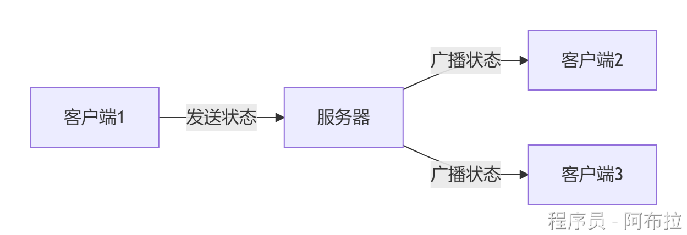
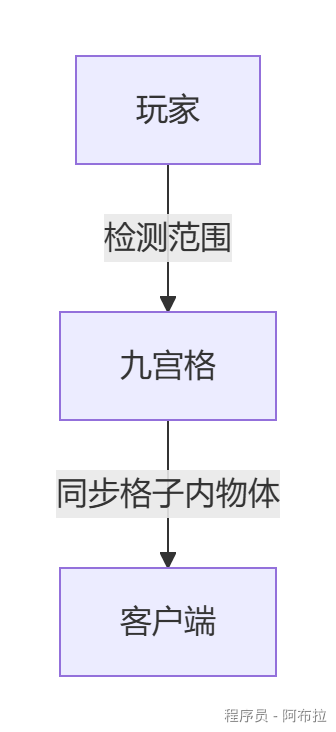

# 状态同步

通过网络将游戏对象的关键属性（位置、血量、动作等）从**服务器**同步到所有**客户端**，确保所有玩家看到的游戏状态一致。
**核心思想**：

- 服务器是“权威”，客户端只负责显示。
- 适合对实时性要求不苛刻的游戏（如MMORPG、沙盒游戏）。

**新手可尝试：**

- 尝试用Unity的`Netcode for GameObjects`实现简单同步。
- 了解`Photon PUN`等第三方工具简化开发。

### **状态同步 vs 帧同步**

| **特性**     | **状态同步**               | **帧同步**                  |
| ------------ | -------------------------- | --------------------------- |
| **同步内容** | 对象属性（位置、血量）     | 玩家输入指令（按键、操作）  |
| **计算位置** | 服务器计算逻辑，客户端渲染 | 所有客户端独立计算相同逻辑  |
| **适用场景** | 大型开放世界、RPG          | 格斗游戏、RTS（如星际争霸） |

### **状态同步实现**

#### **1. 网络架构选择**

- **服务器-客户端模式**：服务器管理所有状态，客户端只接收（防作弊强）。



- **P2P模式**：玩家直接互传状态（适合小规模游戏，如联机对战）。

#### **2. 核心组件**

Unity提供以下工具实现状态同步：

- `NetworkIdentity`：标记需要同步的游戏对象。
- `NetworkTransform`：自动同步物体的位置/旋转。
- `SyncVar`：同步脚本中的变量（如血量、分数）。

```js
using Unity.Netcode;

public class PlayerHealth : NetworkBehaviour {
    [SyncVar]  // 标记需要同步的变量
    public int currentHealth = 100;

    [Server]  // 仅服务器可调用
    public void TakeDamage(int damage) {
        currentHealth -= damage;
    }
}
```

#### **3. 状态插值优化**

直接更新位置会导致“跳跃”，需平滑过渡：

*(代码：平滑移动其他玩家角色)*

```js
void Update() {
    if (!IsOwner) {  // 非本地玩家
        transform.position = Vector3.Lerp(
            transform.position, 
            targetPosition,  // 服务器发来的目标位置
            Time.deltaTime * 10f  // 插值速度
        );
    }
}
```

### **优化**

1. **带宽优化**： 

- 只同步变化的数据（如位置仅传X/Z，Y轴通过重力计算）。
- 压缩浮点数（如位置精度保留2位小数）。

2. **延迟处理**： 

- **客户端预测**：本地先移动，服务器修正位置（如FPS游戏）。
- **缓存历史状态**：丢包时用旧数据插值。

3. **AOI（**只同步玩家周围的物体状态**）**


