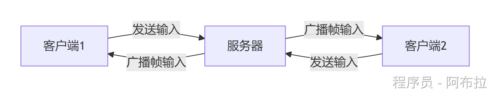

# 帧同步

Unity中的帧同步（Frame Synchronization）是一种用于**多人在线游戏的同步技术**，其核心目标是确保所有客户端在同一逻辑帧上执行相同的操作，从而保证游戏状态的一致性。以下是帧同步的关键要点：

**基础流程**

- **输入同步**：所有客户端将操作指令（如按键、技能释放）发送至服务器，服务器按帧号排序后广播。
- **逻辑一致性**：每个客户端基于相同输入和初始状态独立计算，确保结果一致。

**与状态同步对比**

- **帧同步**：传输操作指令（如“按下A键”），客户端本地计算状态。
- **状态同步**：直接传输状态数据（如“玩家坐标(10,20)”）。

### **帧同步实现**

#### **网络架构选择**

- **服务器模式**（推荐）： 



 服务器收集所有输入后按帧号广播，确保执行顺序一致。

#### **关键代码示例**

- **帧率控制与输入同步**： 

```js
public class FrameSync : MonoBehaviour {
    private const int TARGET_FPS = 30; // 逻辑帧率
    private float frameInterval;
    private int currentFrame;
    private Queue<InputData> inputQueue = new Queue<InputData>();

    void Start() {
        frameInterval = 1f / TARGET_FPS;
        StartCoroutine(SyncFrames());
    }

    IEnumerator SyncFrames() {
        while (true) {
            // 1. 采集输入
            InputData input = GatherInput();
            inputQueue.Enqueue(input);

            // 2. 发送输入到服务器（示例简化）
            SendInputToServer(input);

            // 3. 执行逻辑帧
            ExecuteFrame(inputQueue.Dequeue());

            yield return new WaitForSeconds(frameInterval);
        }
    }
}
```

#### **优化技术**

- **客户端预测**：本地先执行输入，服务器校正时回溯重演（如图示红框部分）。
- **插值渲染**：逻辑帧（30FPS）与渲染帧（60FPS）分离，通过插值平滑显示。

### **常见问题**

1. **网络延迟**：

- **预测+补偿**：客户端预测移动，服务器修正时插值过渡。
- **UDP协议**：优先使用UDP减少延迟（需自定义可靠性层）。

2. **浮点数差异**：

- **定点数计算**：避免不同硬件浮点精度误差导致不同步。

## 面试题

**帧同步要注意哪些点?**

**首先要注意点就是什么样的游戏，能采用帧同步。**

1. 同一局游戏，对战的玩家的数目是有限的，一般小于 < 50人左右，比如MMORPG，这种就不适合帧同步。
2. 如果一局游戏，很长时间无法结束，那么不能使用帧同步，比如MMORPG这种一直可以玩没有结束的游戏这种不适合帧同步。

**通讯选择**

接下来帧同步要解决的问题就是通讯选择，目前主流的做法是TCP/UPD/可靠UDP(如 KCP 等)

具体可以根据团队的技术能力，技术积累，游戏的发布平台等综合考虑。

1. 比如H5，我们大概率会采用TCP作为帧同步。
2. 如果是做手机游戏，可以考虑用UDP，KCP 等，有些运营的平台不允许用UDP，只能用TCP。所以在做项目之前要综合考虑好。UDP确实有更好的体验，但是TCP，部署安全等，会更方便。

**帧同步服务端的广播频率的选择**

15~20FPS左右，一般常见的事件广播频率。

**帧同步确定性的选择**

包括定点数、随机数。根据自己的游戏类型，提前确定好所需要做确定性的代码库，比如确定性无力引擎，确定性的RVO等。

**说说项目中网络同步,延迟问题 如何解决的?**

​	网络同步延迟问题 是做网络游戏开发中比较经典的问题，要考虑这个问题，我们首先要搞清楚，我们的游戏同步采用的是帧同步还是状态同步。

如果游戏是状态同步

那么要解决网络延时问题，只能通过传输来解决，一般用可靠的UDP来做，比如kcp等。减少网络延时，和网络波对对游戏的体验。由于状态同步是服务端跑逻辑,客户端根据状态来展示，所以除了底层通过可靠UDP来减少网络延时以外，没有其它的办法。

如果是帧同步

每一帧，服务端会把所有客户端的操作转发出去，这个时候要解决网络延时问题，也是用UDP来代替传统的TCP， 来做数据通讯，如果某个数据包卡住的情况下，客户端，可以用上一帧的操作，延长几帧的处理时间，做所谓的"预演"，如果下一帧来的操作，刚好和上一帧一样，那么预演成功，客户端感觉不出来卡顿。不成功，客户端会卡顿。
