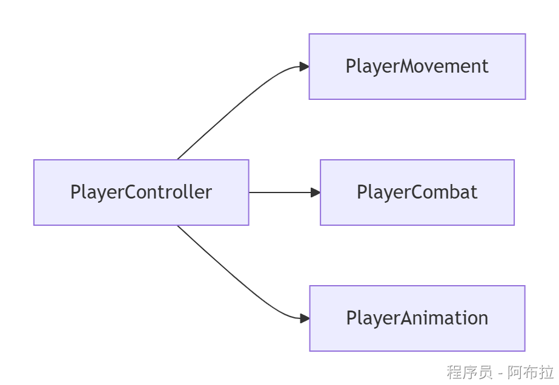
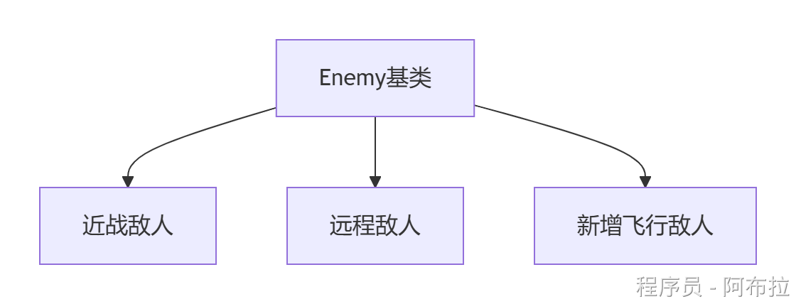
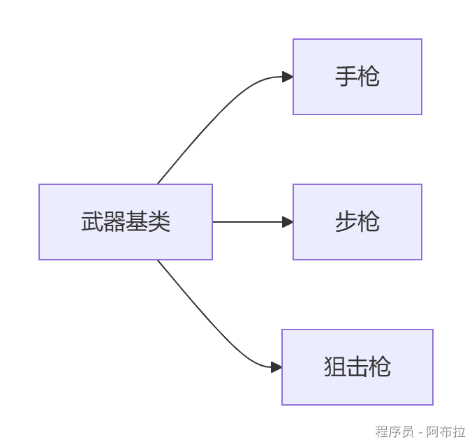
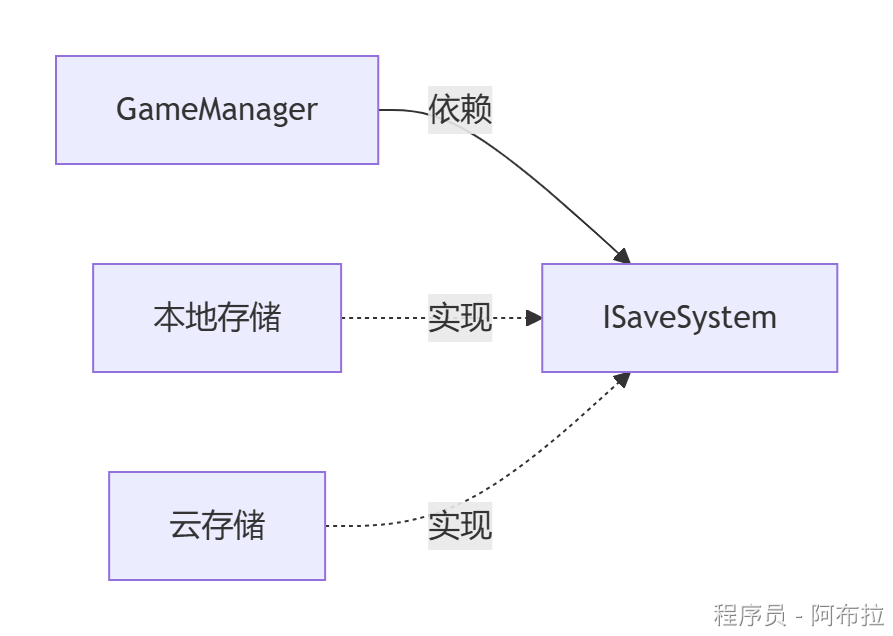
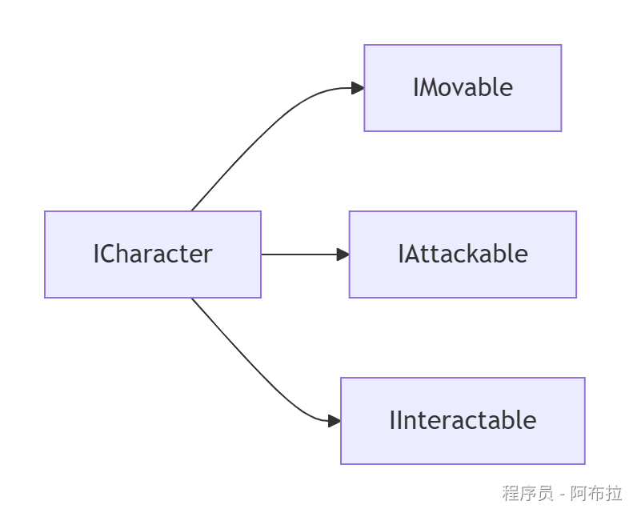
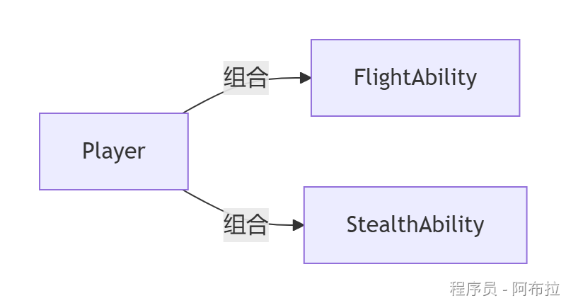
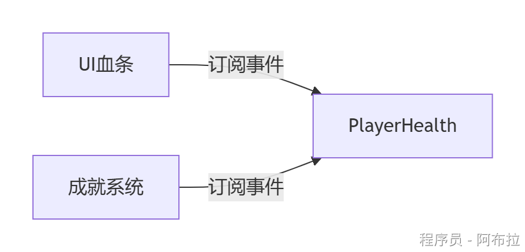

# 七大原则

七大原则的核心目标是**解耦**与**高内聚**

**解耦**

通过依赖抽象（DIP）、接口隔离（ISP）、中介者模式（LoD）降低模块间依赖。

**高内聚**

单一职责（SRP）确保模块功能聚焦；开闭原则（OCP）和合成复用（CRP）提升扩展性。

在Unity中，这些原则与**组件化架构**天然契合：每个`MonoBehaviour`应职责单一，通过事件/接口通信，避免“脚本链式调用”。结合ScriptableObject（数据抽象）和ECS（组合优于继承），可构建灵活且易维护的游戏系统。

### 1. 单一职责原则 (Single Responsibility Principle, SRP)

- **定义**：一个类只负责一项功能，引起类变更的原因应唯一。
- **Unity应用**：避免编写“万能脚本”。例如，将角色移动、攻击、动画控制拆分为独立的`MonoBehaviour`脚本，而非全部塞入`PlayerController`。



```js
// 错误：一个脚本处理移动和攻击  
public class Player : MonoBehaviour {  
    void Move() { /* ... */ }  
    void Attack() { /* ... */ }  
}  
// 正确：拆分职责  
public class PlayerMovement : MonoBehaviour { /* 移动逻辑 */ }  
public class PlayerCombat : MonoBehaviour { /* 攻击逻辑 */ }
```

### 2. **开闭原则 (Open-Closed Principle, OCP)**

- **定义**：模块应对扩展开放，对修改关闭。新增功能时通过扩展（如继承、组合）实现，而非修改原有代码。
- **Unity应用**：使用接口或抽象类定义核心行为，通过子类实现扩展。例如，技能系统通过`ISkill`接口支持新技能类型。



```js
public abstract class Enemy : MonoBehaviour {  
    public abstract void ExecuteAI();  
}  
public class MeleeEnemy : Enemy { /* 近战AI */ }  
public class RangedEnemy : Enemy { /* 远程AI */ }  // 扩展无需修改基类
```

### 3. **里氏替换原则 (Liskov Substitution Principle, LSP)**

- **定义**：子类必须能替换父类而不影响程序正确性。
- **Unity应用**：继承体系需保持行为一致性。例如，若`Bird`类有`Fly()`方法，则企鹅子类不应重写为抛出异常，而应重构继承关系（如拆分`FlightlessBird`）。
- **风险案例**：父类`Weapon`设计为可攻击，子类`NonCombatItem`若无法攻击则违反LSP。



### 4. **依赖倒置原则 (Dependency Inversion Principle, DIP)**

- **定义**：高层模块不依赖低层模块，二者依赖抽象；抽象不依赖细节，细节依赖抽象。
- **Unity应用**：通过接口解耦模块。例如，游戏管理类依赖`ISaveSystem`接口存取数据，而非具体`BinarySaveSystem`或`CloudSaveSystem`实现。



```js
public interface ISaveSystem { void Save(GameData data); }  
public class GameManager : MonoBehaviour {  
    private ISaveSystem _saveSystem; // 依赖抽象  
}
```

### 5. **接口隔离原则 (Interface Segregation Principle, ISP)**

- **定义**：客户端不应被迫依赖其不需要的接口方法。应拆分庞大接口为多个专用接口。
- **Unity应用**：避免“上帝接口”。例如，将`ICharacter`拆分为`IMovable`（移动）、`IAttackable`（攻击）、`IInteractable`（交互）。
- **优势**：减少UI模块对角色战斗方法的依赖，仅需`IInteractable`。



### 6. **合成复用原则 (Composite Reuse Principle, CRP)**

- **定义**：优先使用组合（has-a）而非继承（is-a）复用功能。
- **Unity应用**：利用组件化设计。例如，角色能力（如飞行、潜水）通过附加`Ability`脚本组合实现，而非多层继承。

```js
public class Player : MonoBehaviour {  
    private List<Ability> _abilities; // 组合能力组件  
}  
public class FlightAbility : MonoBehaviour { /* ... */ }
```



### 7. **迪米特法则 (Law of Demeter, LoD) / 最少知识原则**

- **定义**：一个对象应对其他对象保持最少了解，仅与直接朋友（成员、参数、返回值）交互。
- **Unity应用**：通过中介者减少耦合。例如，UI元素不直接访问游戏状态，而是通过`UIManager`转发请求。 



```js
// 错误：UI直接访问Player  
healthBar.value = GameObject.Find("Player").GetComponent<Player>().Health;  
// 正确：通过事件通知  
public class Player : MonoBehaviour {  
    public event Action<int> OnHealthChanged;  
}  
public class HealthUI : MonoBehaviour {  
    void OnHealthChanged(int health) { /* 更新UI */ }  
}
```
