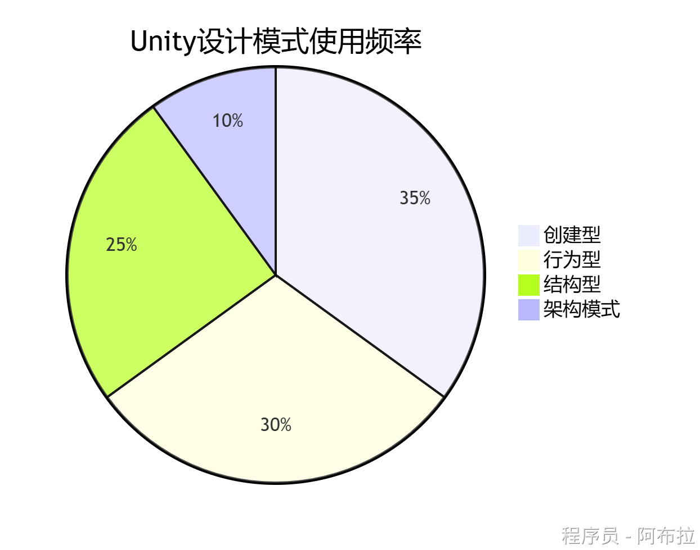
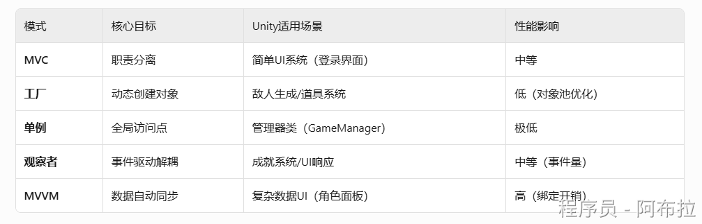
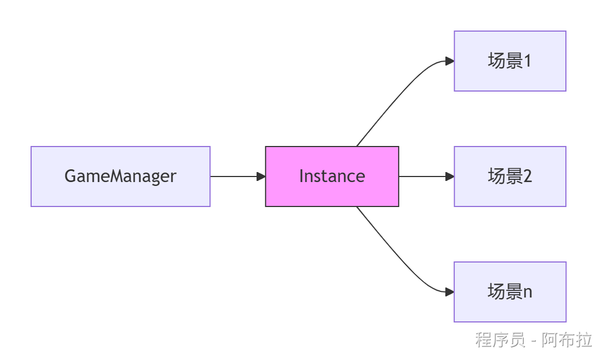
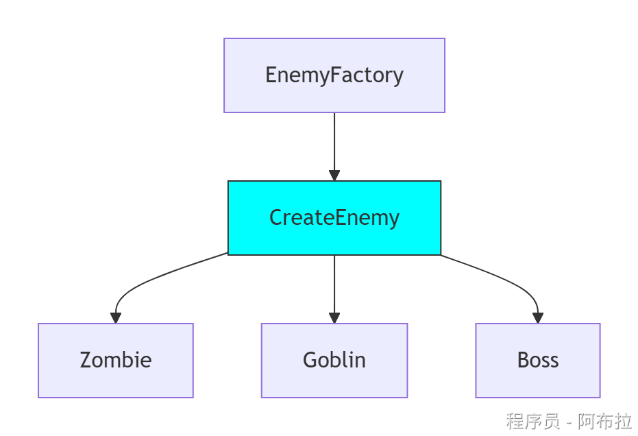
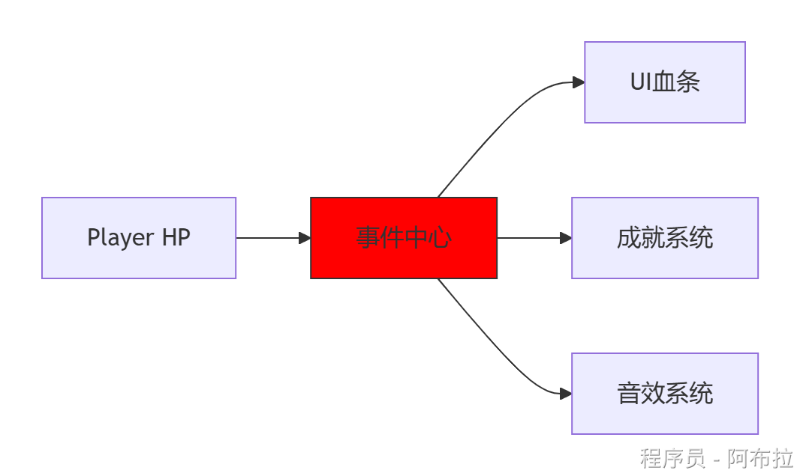
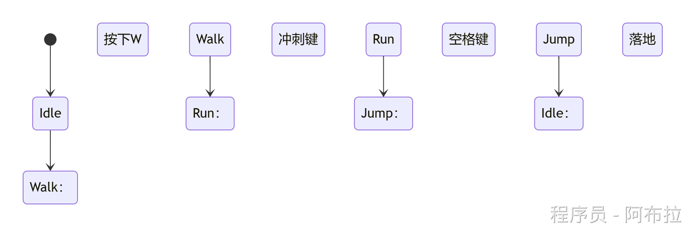
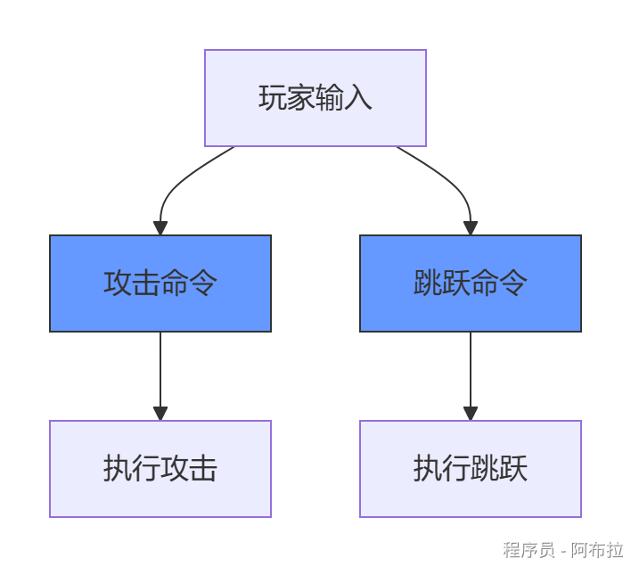
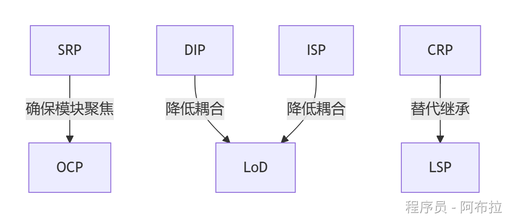

# 常用模式

**单例**和**观察者**是Unity中最常用的模式。

**工厂模式**适合动态资源加载，**状态模式**适合复杂行为管理。

架构模式（如MVVM）在复杂UI项目中优势明显。

### 创建型模式：对象创建机制

#### **单例模式 (Singleton)**

- **核心**：全局唯一实例，提供统一访问点
- **Unity应用**：管理器类（GameManager、AudioManager）

*说明：通过静态实例跨场景共享，配合* `DontDestroyOnLoad` *实现*

#### **工厂模式 (Factory)**

- **核心**：封装对象创建逻辑
- **类型**： 

- **简单工厂**：单方法创建多种对象（如敌人生成）
- **工厂方法**：子类决定实例化类型（如武器系统）

*说明：通过* `Instantiate` *动态生成预制体，隔离创建逻辑*

#### 原型模式

快速复制预制件（如`Clone()`方法）

### 结构型模式：对象组合方式

#### **适配器模式 (Adapter)**

- **核心**：转换接口使不兼容类协作
- **Unity应用**：第三方SDK接入、旧系统改造

*说明：封装原生插件调用，统一接口规范*

#### **装饰器模式 (Decorator)**

- **核心**：动态添加功能（非继承）
- **Unity应用**：角色技能叠加、装备特效

*说明：通过组件嵌套实现功能扩展*

#### 享元模式

共享资源（如重复使用的纹理/网格）

### 行为型模式：对象交互策略

#### **观察者模式 (Observer)**

- **核心**：事件驱动解耦
- **Unity应用**：UI响应、成就系统

*说明：基于* `UnityEvent` *或* `Action` *实现发布-订阅*

#### **状态模式 (State)**

- **核心**：状态机管理行为切换
- **Unity应用**：角色动画、AI行为

*说明：与Animator Controller天然契合，状态独立封装*

#### **命令模式 (Command)**

- **核心**：封装操作为对象
- **Unity应用**：操作回放、输入控制

*说明：实现* `Undo/Redo` *功能的基础*

#### 策略模式

动态切换AI行为（如巡逻/追击策略）

### **原则间的协同**

通过 **高内聚（SRP/OCP）** 与 **低耦合（DIP/ISP/LoD）** 构建可维护的Unity架构。

**Unity最佳实践**：

- 用 **ScriptableObject** 实现数据抽象（OCP）
- 用 **事件系统** 代替直接对象引用（LoD）
- **组件化设计** 天然契合合成复用原则（CRP）

